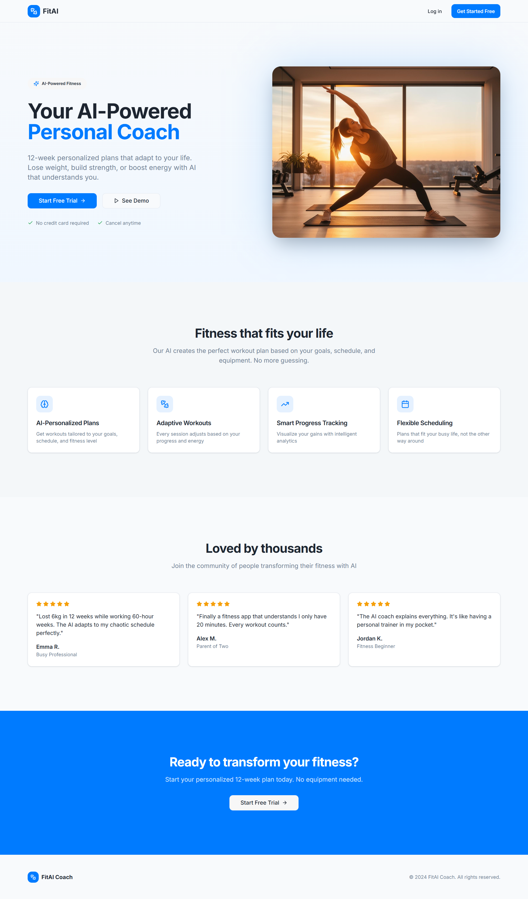
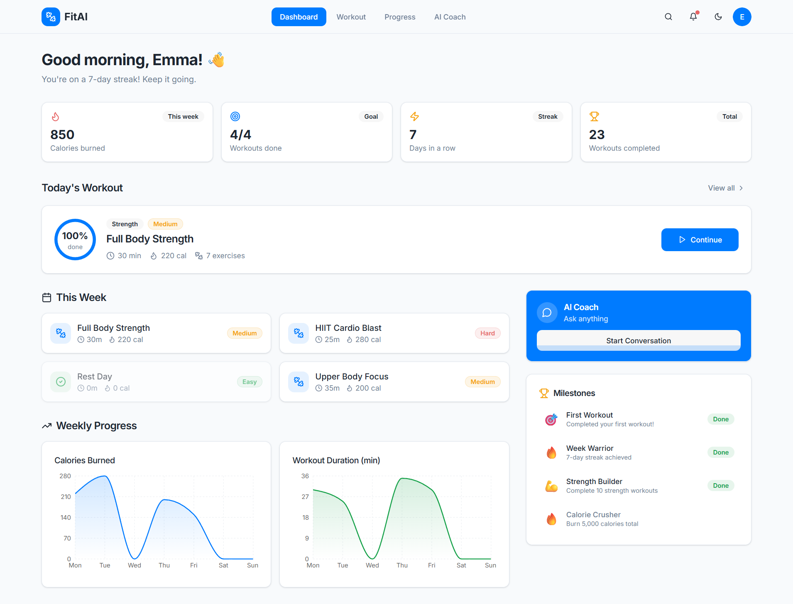
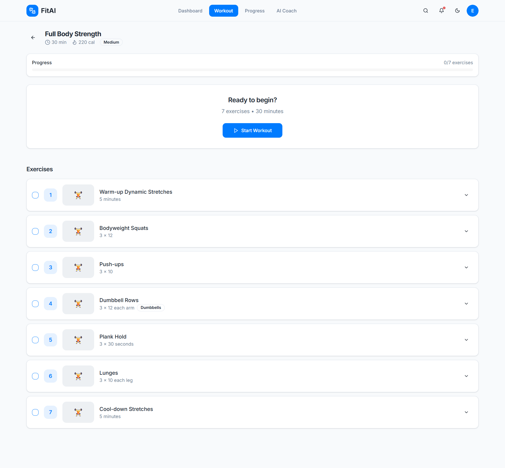
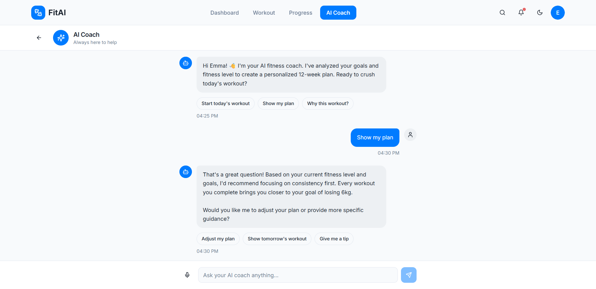

# FitAI – AI-Powered Personal Fitness Coach

FitAI is a product demo that showcases the concept of an AI-powered personal fitness coach designed to deliver personalized workout plans, guided training sessions, progress tracking, and conversational coaching.

This repository is intended for **product demonstration, stakeholder review, and client sign-off** before moving into full-scale development.

---

## 1. Project Overview

FitAI demonstrates how an AI-driven fitness platform can support users throughout their fitness journey — from onboarding and daily workouts to progress tracking and real-time coaching guidance.

The demo focuses on **user experience, core product flows, and AI-driven interactions**, using realistic mock data and scenarios to clearly communicate the product vision.

Key goals of this demo:

- Illustrate AI-driven personalization based on goals and fitness level  
- Showcase guided workout experiences  
- Visualize progress and motivation over time  
- Demonstrate conversational AI coaching support  

---

## 2. Core User Journey

Landing Page
↓
Dashboard (Daily Overview)
↓
Workout Session
↓
Progress Tracking
↘
AI Coach (Guidance & Support)

Each screen represents a key moment in the user’s fitness journey and is designed to feel cohesive, motivating, and easy to understand.

---

## 3. Screens Included in This Demo

### A. Landing Page (Product Introduction)

The landing page introduces FitAI’s value proposition and positions the product as a smart, adaptive fitness coach.

**Highlights:**
- Clear AI-powered value proposition  
- 12-week personalized fitness plans  
- Primary call-to-action for trial or demo  
- Feature overview:
  - AI-personalized plans  
  - Adaptive workouts  
  - Smart progress tracking  
  - Flexible scheduling  

---

### B. Dashboard (Daily Overview)

The dashboard provides a snapshot of the user’s daily and weekly fitness activity, encouraging consistency and motivation.

**Displayed information:**
- Calories burned (weekly)
- Workouts completed vs goal
- Current workout streak
- Total workouts completed

**Additional sections:**
- Today’s workout summary
- Weekly workout schedule
- AI Coach quick access
- Milestones and achievements

---

### C. Workout Session (Guided Training)

This screen demonstrates a structured and guided workout experience.

**Features shown:**
- Workout summary (duration, calories, difficulty)
- Step-by-step exercise list
- Sets, reps, and equipment indicators
- Clear call-to-action to start the workout
- Progress tracking across exercises

---

### D. Progress Tracking

The progress page visualizes long-term performance and goal completion.

**Key elements:**
- 12-week goal progress indicator
- Weekly summary metrics:
  - Workouts completed
  - Calories burned
  - Minutes trained
  - Active streak
- Trend charts for calories and workout duration
- Achievement badges for motivation

---

### E. AI Coach (Conversational Guidance)

The AI Coach demonstrates how users can interact with an intelligent assistant throughout their fitness journey.

**Capabilities shown:**
- Personalized greetings
- Context-aware coaching responses
- Suggested quick actions:
  - Start today’s workout
  - View training plan
  - Understand workout recommendations
  - Adjust plans or request tips

This screen highlights how AI adds clarity, motivation, and guidance beyond static workout plans.

---

## 4. Demo Scope & Assumptions

- All data is **mocked** for demonstration purposes  
- AI responses are simulated to reflect realistic coaching behavior  
- No backend, authentication, or payment integrations are included  
- The demo focuses on **concept validation and user flow clarity**  

---

## 5. Intended Use

This repository is designed to support:

- Client and stakeholder walkthroughs  
- Product vision alignment  
- Scope validation before development  
- UX and product feedback sessions  

It is **not intended to represent a production-ready system**.

---

## 6. Possible Next Steps

This demo can be extended into a full product by:

- Integrating real AI models for coaching and personalization  
- Connecting wearable devices for live fitness data  
- Implementing user accounts and subscriptions  
- Adding exercise videos and detailed instructions  
- Building native mobile applications  

---

## 7. License & Disclaimer

This project is a **conceptual demo** created for demonstration and planning purposes only.

All user data, metrics, and scenarios shown are fictional.